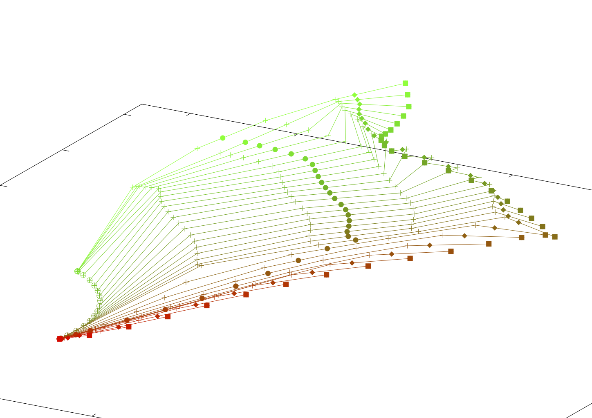
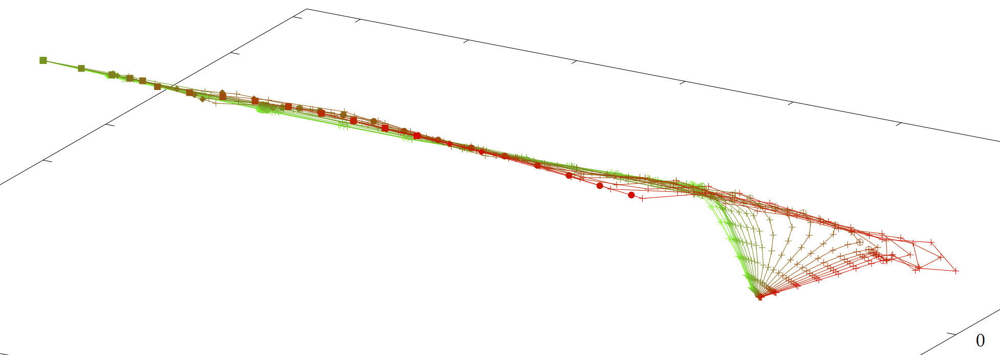

## [The RHex project](https://rhexman.github.io/RHex/)

Click on the blue text above to go to the RHex page.

This project contains two primary applications, RHexSwing3D and RHexCast3D, that create realistic dynamic 3D computer simulations of, respectively, a swung fly line, leader, tippet and fly combination in a moving stream, and a rod and line during an aerial cast.

### An example of static output from RHexSwing3D

### And one from RHexCast3D

