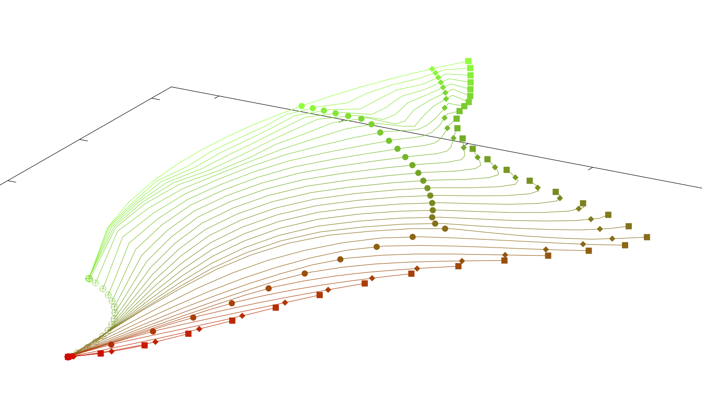

### These are the projects collected under RHexMan.  Click on the blue subheaders to start through the hierarchy of project pages.

## [RHex](https://rhexman.github.io/RHex/)

This project contains two primary applications, RHexSwing3D and RHexCast3D, that create realistic dynamic 3D computer simulations of, respectively, a swung fly line, leader, tippet and fly combination in a moving stream, and a rod and line during an aerial cast.

### An example of static output from RHexSwing3D

## [Steelhead](https://rhexman.github.io/Steelhead)

Contains the Steelhead Runs Google Earth overlay and a collection of steelhead rivers fishing maps.

### A still from the overlay

### And a map detail

## [Trout](https://rhexman.github.io/Trout)

Trying to make sense of the bugs trout eat, and what that means for the angler.  Includes a novel spatio-temporal form of hatch chart and supporting discussion.

### A fragment from the mayfly emergence chart

